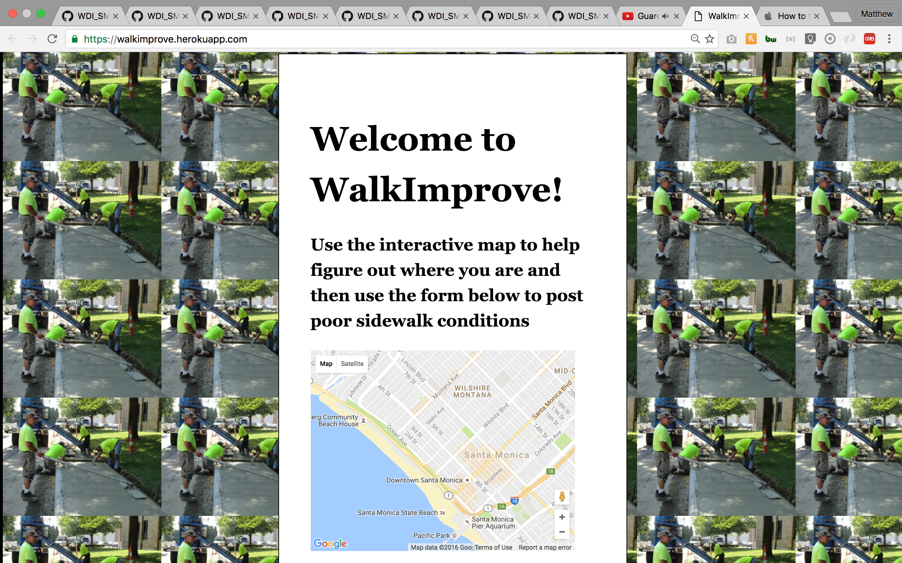
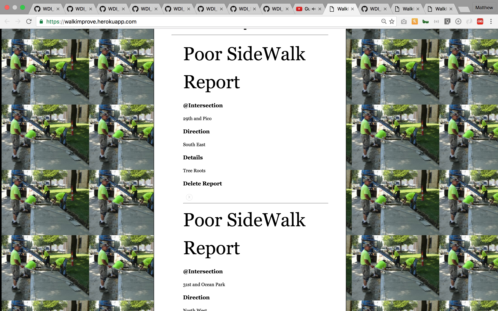

#WalkImprove Front - A sidewalk condition reporting app

* This is a MEAN stack app that takes consumes walkimprove's api of  reports regarding poor sidewalk conditions in Los Angeles and displays them to the user and allows the user to seemlessly report poor sidewalks

* Technologies used: MEAN stack, Mongo, Express, Angular, Node, HTML, CSS, Javascript, jQuery, Passport, Heroku, Google maps, Oauth2 and git.

* Approach taken: research different front end options, deciding angular is the best option, researching angular, developing small app's that consume api, scaling and configuring for connecting with my MEN stack API.

* Installation instructions: Git clone the remote repo https://github.com/matthewbrozen/walkimprovefrontend, open folder in terminal, touch .env file, touch Procfile, in terminal $ npm install, in terminal $ node server.js

* Further development: Welcome page for non-authenticated users, search feature, show method for a report that allows other users to comment. 

#Screen Shots

#Project 4 Main Repo
[main repo](https://github.com/matthewbrozen/project4)  

#WalkImprove API
[API repo](https://github.com/matthewbrozen/walkimproveapi)
